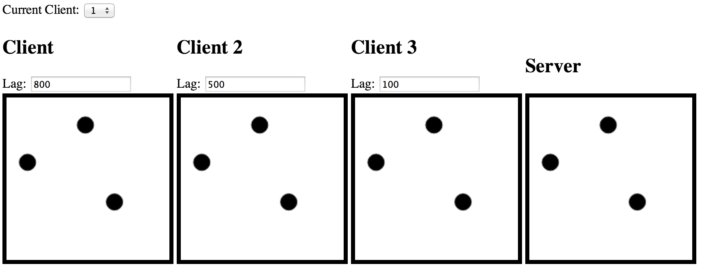

#Multiplayer Simulation

Simulate a multiplayer action game on the client. The idea is to understand how the message queues processing occurs on client and server having different frame rates and different network latencies.

Great article about it [here](http://www.gabrielgambetta.com/fpm1.html)

##Screenshot

##LICENSE
MIT
